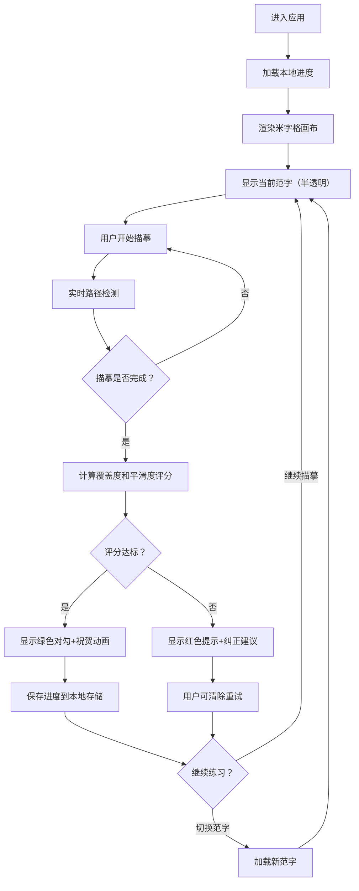

## 1. 产品概述
练字描红本是一款在线书法练习工具，帮助用户通过描摹范字练习书写汉字和英文花体字。用户可以在米字格画布上跟随半透明范字进行描摹练习，系统自动检测描摹质量并给出反馈，练习进度保存至本地存储。

- 目标用户：书法初学者、汉字爱好者、英文书写练习者
- 产品价值：无需实体田字格本即可随时随地练习书法，提供即时反馈和进度追踪

## 2. 核心功能

### 2.1 用户角色
| 角色 | 注册方式 | 核心权限 |
|------|----------|----------|
| 普通用户 | 无需注册，直接使用 | 使用全部描摹功能、查看历史进度、切换范字 |

### 2.2 功能模块
1. **主页面**：米字格画布区域、范字选择面板、进度统计面板
2. **描摹画布**：米字格渲染、半透明范字显示、鼠标/触屏描摹输入
3. **路径检测**：笔画覆盖度检测、线条平滑度分析、描摹完成反馈
4. **范字库**：常用汉字库（简单→复杂）、英文花体字库
5. **进度管理**：本地存储描摹记录、完成状态追踪、统计展示

### 2.3 页面详情
| 页面名称 | 模块名称 | 功能描述 |
|----------|----------|----------|
| 主页面 | 顶部标题栏 | 应用名称、主题切换、帮助按钮 |
| 主页面 | 范字选择区 | 汉字/英文切换标签、范字列表、难度筛选 |
| 主页面 | 描摹画布区 | 3×3 米字格布局、每个格子独立描摹、格子状态指示 |
| 主页面 | 实时反馈区 | 当前描摹评分、笔画提示、完成祝贺动画 |
| 主页面 | 进度统计区 | 今日练习字数、累计完成数、最佳成绩展示 |
| 主页面 | 控制按钮区 | 清除当前、重新开始、上一字、下一字 |

## 3. 核心流程
用户进入应用后，默认加载简单汉字"大"。用户在米字格上用鼠标描摹半透明范字，系统实时检测路径。描摹完成后自动评分，优秀则显示绿色对勾，偏差较大给出纠正提示，完成的格子会记录并保存到本地。用户可切换不同范字或练习英文花体。

## 4. 用户界面设计

### 4.1 设计风格
- **主色调**：宣纸米白 `#F5F0E6` 为底色，墨黑 `#2C2C2C` 为文字，朱红 `#C53D43` 为印章/对勾色
- **辅助色**：浅灰 `#B8B8B8` 米字格线，淡墨灰 `#8A8A8A` 半透明范字
- **按钮风格**：圆角矩形，轻微阴影，hover 时微微上浮
- **字体**：标题使用楷体（KaiTi）/STKaiti，范字使用楷体，英文花体使用 Dancing Script 或 Great Vibes
- **布局风格**：顶部导航 + 左右分栏（左侧范字选择+进度，右侧大面积画布）
- **视觉元素**：加入宣纸纹理背景、毛笔笔触效果、红色印章元素

### 4.2 页面设计概览
| 页面名称 | 模块名称 | UI 元素 |
|----------|----------|----------|
| 主页面 | 顶部标题栏 | 左侧毛笔图标+楷体标题"描红本"，右侧帮助按钮，居中对齐 |
| 主页面 | 范字选择区 | 卡片式布局，汉字/英文切换 Tab，当前选中范字高亮边框 + 朱红印章标记 |
| 主页面 | 描摹画布区 | 3×3 米字格网格，每格 160×160px，米字格虚线+实线结合，范字淡灰色居中显示 |
| 主页面 | 实时反馈区 | 浮动卡片，评分用环形进度条，文字提示区域，完成时弹出祝贺动画 |
| 主页面 | 进度统计区 | 三个数据卡片：今日练习、累计完成、最佳评分，配小图标 |
| 主页面 | 控制按钮区 | 一排圆角按钮：清除、重试、上一个、下一个，间距均匀 |

### 4.3 响应式设计
- **桌面端优先**：左右分栏布局，画布区域占 60% 宽度
- **平板适配**：上下布局，范字选择区移至画布上方
- **手机适配**：单列布局，2×2 米字格缩小显示，支持触屏描摹
- **触屏优化**：增加线条粗细阈值，优化触摸事件响应

### 4.4 动效设计
- 页面加载：各模块渐入 + 轻微上浮（staggered 动画）
- 描摹开始：鼠标光标变为毛笔样式
- 完成格子：对勾图标弹性缩放出现，轻微撒花粒子效果
- 切换范字：旧字淡出 → 新字淡入，画布轻微光晕过渡
- 按钮 hover：背景色过渡 + translateY(-2px) + 阴影加深
