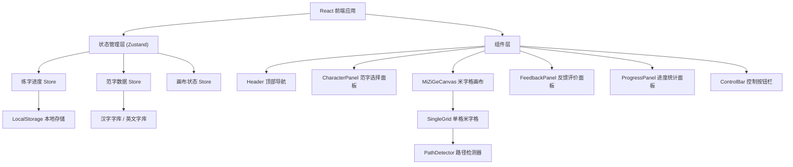

## 1. 架构设计


## 2. 技术描述
- **前端框架**：React@18 + TypeScript@5
- **构建工具**：Vite@5
- **样式方案**：TailwindCSS@3 + 自定义 CSS（宣纸纹理、毛笔效果）
- **状态管理**：Zustand@4
- **路由**：单页应用，无需路由
- **图标库**：lucide-react
- **字体**：Google Fonts (KaiTi 替代 + Dancing Script 英文花体)
- **存储**：浏览器 localStorage
- **后端**：无，纯前端应用

## 3. 路由定义
| 路由 | 用途 |
|------|------|
| / | 主页面，包含全部功能模块 |

## 4. 核心数据模型

### 4.1 范字数据模型
```typescript
interface Character {
  id: string;
  char: string;          // 字符内容
  type: 'chinese' | 'english';  // 类型
  difficulty: 1 | 2 | 3; // 难度等级：1简单 2中等 3复杂
  strokes?: number;      // 汉字笔画数（可选）
}
```

### 4.2 描摹进度数据模型
```typescript
interface ProgressRecord {
  characterId: string;
  bestScore: number;     // 0-100 最佳评分
  practiceCount: number; // 练习次数
  completedCount: number; // 完成次数（达标）
  lastPracticeAt: number; // 上次练习时间戳
}

interface UserProgress {
  records: Record<string, ProgressRecord>;
  totalPracticed: number;
  todayPracticed: number;
  todayDate: string;     // YYYY-MM-DD 用于判断是否跨天
}
```

### 4.3 描摹格子状态
```typescript
interface GridState {
  gridIndex: number;     // 0-8 九宫格索引
  isActive: boolean;     // 是否当前激活格子
  paths: PathPoint[][];  // 用户绘制的笔画路径
  score: number | null;  // 评分
  status: 'idle' | 'drawing' | 'completed' | 'failed';
}

interface PathPoint {
  x: number;
  y: number;
  pressure?: number;     // 压感（可选，触屏设备）
  timestamp: number;
}
```

## 5. 路径检测算法

### 5.1 核心思路
1. **范字二值化**：将半透明范字渲染到隐藏 Canvas，提取非透明像素作为目标区域
2. **用户路径采样**：将用户绘制的路径转换为像素集合
3. **覆盖度计算**：`重叠像素数 / 范字总像素数 × 100%`
4. **溢出度计算**：`超出范字范围的像素数 / 用户总像素数`
5. **综合评分**：`覆盖度 × 0.7 - 溢出度 × 0.3`，映射到 0-100 分

### 5.2 评分等级
- ≥ 85 分：优秀 🟢 绿色对勾
- 70-84 分：良好 🟡 黄色提示
- 50-69 分：及格 🟠 橙色提示
- < 50 分：需练习 🔴 红色提示，可重试

## 6. 文件结构
```
src/
├── components/
│   ├── Header.tsx          # 顶部导航
│   ├── CharacterPanel.tsx  # 范字选择面板
│   ├── MiZiGeCanvas.tsx    # 米字格画布容器
│   ├── SingleGrid.tsx      # 单个米字格（Canvas）
│   ├── FeedbackPanel.tsx   # 反馈评价面板
│   ├── ProgressPanel.tsx   # 进度统计面板
│   └── ControlBar.tsx      # 控制按钮栏
├── hooks/
│   ├── useDrawing.ts       # 绘制逻辑钩子
│   ├── usePathDetection.ts # 路径检测钩子
│   └── useLocalStorage.ts  # 本地存储钩子
├── store/
│   ├── useProgressStore.ts # 进度状态管理
│   └── useCharacterStore.ts # 范字状态管理
├── data/
│   ├── chineseChars.ts     # 汉字库数据
│   └── englishChars.ts     # 英文字库数据
├── utils/
│   ├── pathDetector.ts     # 路径检测算法
│   └── storage.ts          # 存储工具函数
├── types/
│   └── index.ts            # 类型定义
├── App.tsx
├── main.tsx
└── index.css
```

## 7. 本地存储键名
- `miaohong_progress`：用户进度数据（JSON 字符串）
- `miaohong_current_char`：当前选中范字 ID
- `miaohong_grid_size`：用户偏好的格子大小（可选）
